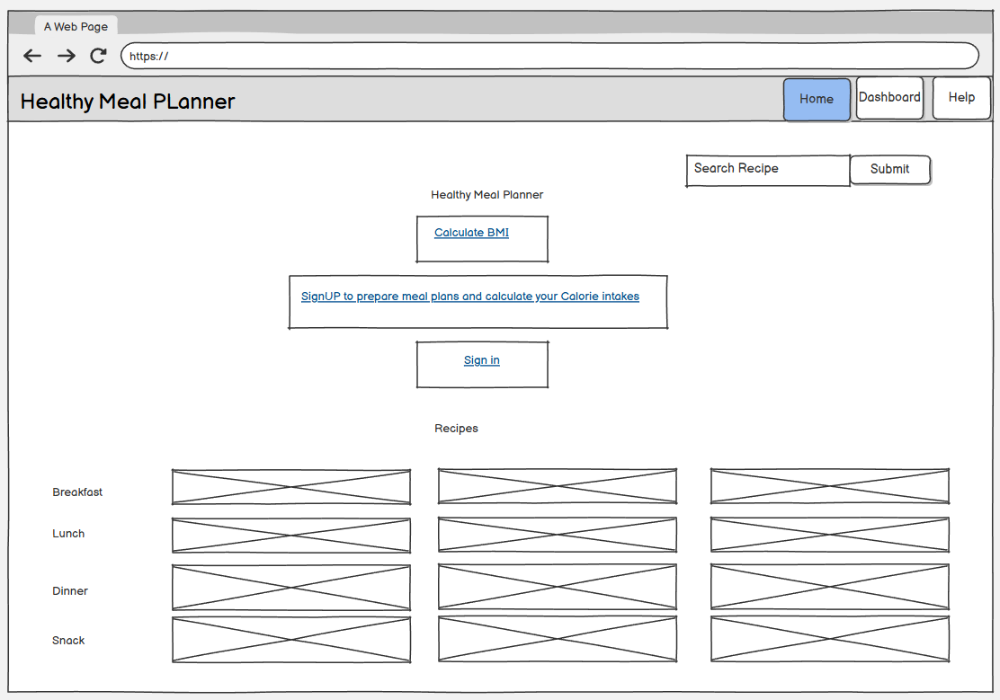

# 🥗 Healthy Meal Planner

Is a meal preparation platform with calorie tracking, BMI calculation, and personalized recipe management. This can be a freesource for a comprehensive database to healthy recipies with customisation per user needs. Keeping track of your meals will be a easy job and once a recipe is store on profile, can be reused indefinitly on the account. User can change portion size to control calorie intake, change recipe ingredients and quantities to make better healthy choices. Profile will keep the trak of weight and BMI. Recipies are free to browse while to gain all benifits of the website user will have to sign up.

🔗 **Live Link:** [Healthy Meal Planner](https://healthy-meal-planner-cc66090aa001.herokuapp.com/)

📂 **Repository:** [darakhshanda/healthy_meal_planner](https://github.com/darakhshanda/healthy_meal_planner)

 **Project Board:** [darakhshanda/projects](https://github.com/users/darakhshanda/projects/9/views/4)

A responsive site layout for easy navigation on different devices.

## Desktop view


## Tablet view


## Mobile view


## 📑 Table of Contents

- [Summary](#-summary)
- [Site Goals](#-site-goals)
- [User Stories](#-user-stories)
- [Technical Architecture](#-technical-architecture)
- [Database Models](#️-database-models)
- [Design](#-design)
- [Features](#-features)
- [Testing](#-testing)
- [Deployment](#-deployment)
- [Technologies Used](#️-technologies-used)
- [Credits](#-credits)
- [Acknowledgments](#-acknowledgments)

## 📖 Summary

**Healthy Meal Planner** is an interactive web application designed to help users manage their nutrition through:

- **Personalized calorie tracking** based on BMI and activity levels
- **Recipe creation and management** with detailed nutritional breakdowns
- **Meal planning** with daily calorie summaries
- **Health metrics monitoring** including BMI calculations

This project solves:

- Difficulty tracking daily caloric intake
- Lack of personalized meal planning tools
- Need for accessible nutrition information
- Complex macro tracking (protein, carbs, fat)

### Target Users

- Health-conscious individuals
- Fitness enthusiasts tracking macros
- Families planning balanced meals
- People managing dietary restrictions
- Anyone seeking nutritional awareness

### Unique Aspects

- Automated BMI and calorie goal calculations
- Ingredient based nutrition tracking, when full scope achieved
- Customizable recipe creation
- Django-powered security and scalability


## 📌 Site Goals

### Core Functionality

- Provide calorie and macro tracking for health-conscious users
- Enable recipe creation, browsing, and management
- Calculate personalized daily calorie goals based on BMI and activity level
- Allow meal planning and tracking against nutritional targets
- Support ingredient management with precise nutritional data

### User Experience

- Clean, intuitive interface for recipe management
- Responsive design for mobile, tablet, and desktop
- Quick access to daily calorie summaries
- Visual nutrition breakdowns with progress indicators
- Secure user authentication and profile management

### Scalability

- Support for recipe sharing and community features
- Expandable to include meal prep scheduling
- Potential API integration for third-party apps
- Multi-user household management

## Overview

This document outlines all the functionalities and features available in the Healthy Meal Planner application, a Django-based web platform designed to help users manage their nutrition through calorie tracking, meal planning, and personalized recipe management.

## 👤 User Stories

### Persona 1: "Sarah – Health-Conscious Parent (Age 35)"

**Description:** A working mother managing nutrition for her family of four.

**Needs:**

- Track family meals and calories
- Quick recipe searches by category
- Weekly meal planning
- Nutritional balance monitoring

**Behavior:**

- Plans meals on weekends
- Searches for healthy recipes during lunch breaks
- Needs mobile access while grocery shopping

**User Stories:**

- ✅ As a parent, I want to plan weekly meals so my family eats balanced nutrition
- ✅ As a busy user, I want to filter recipes by category so I can find dinner ideas quickly
- ✅ As a meal planner, I want to see weekly calorie summaries so I can adjust portions
- ✅ As a user, I want to save favorite recipes so I can reuse successful meals

---

### Persona 2: "Mike – Fitness Enthusiast (Age 28)"

**Description:** A gym-goer focused on muscle building and precise macro tracking.

**Needs:**

- Precise protein, carb, and fat tracking
- Custom meal plans matching training days
- BMI and calorie calculations
- Recipe nutritional breakdowns

**Behavior:**

- Logs meals immediately after eating
- Tracks macros to the gram
- Adjusts calorie goals based on workout intensity

**User Stories:**

- ✅ As a fitness user, I want to track macros so I meet my training goals
- ✅ As a user, I want BMI calculations so I monitor my health progress
- ✅ As an athlete, I want to adjust calorie goals based on activity level
- ✅ As a meal tracker, I want to see daily remaining calories so I stay on target

---

### Persona 3: "Emma – Weight Management User (Age 42)"

**Description:** Someone working with a nutritionist to achieve sustainable weight loss.

**Needs:**

- Calorie deficit tracking
- Simple recipe creation
- Daily progress visualization
- Healthy ingredient substitutions

**Behavior:**

- Checks calorie budget multiple times daily
- Prefers simple, low-calorie recipes
- Needs encouragement and progress tracking

**User Stories:**

- ✅ As a weight-loss user, I want to see remaining daily calories so I don't exceed my limit
- ✅ As a user, I want to create custom recipes so I control ingredients
- ✅ As a health tracker, I want to update my weight so my calorie goals adjust automatically
- ✅ As a user, I want visual progress indicators so I stay motivated

---

### Additional User Needs

- 🔹 As a vegetarian, I want to filter recipes by dietary preference
- 🔹 As a diabetic, I want to see carb content prominently displayed
- 🔹 As a mobile user, I want responsive design so I can log meals on-the-go
- 🔹 As a privacy-conscious user, I want secure login so my health data stays private
- 🔹 As a beginner cook, I want step-by-step instructions so recipes are easy to follow


## **Project Board**


## **List View**

-

## 🧱 Technical Architecture

### **ERD (Entity Relation Diagram)**


### **Project Scope** 


### **Tech Stack**

- **Backend:** Python 3.13, Django 5.0
- **Frontend:** HTML5, CSS3, JavaScript  
- **Database:**  
  - PostgreSQL (production)  
  - SQLite (development/testing)  
- **Authentication:** Django built-in auth system (with custom user profile extension)
- **Image Handling:** Cloudinary

---

### **Django Planner Project Structure**

#### **`mealplan`**

**Handles:**

- User registration, login, logout  
- Profile creation & editing  
- Storing user health metrics  
- Calculating BMI & calorie goals
- Recipe CRUD operations  
- Ingredient management  
- Nutrition calculations  
- Recipe categories  
- Image uploads  
- Daily calorie tracking  
- Meal plan creation  
- Consumed vs remaining calorie summaries  
- Daily nutrition breakdowns

---

## 🗄️ Database Models

```python

planner/
│ 
├── mealapp/              # User authentication & main app
│   ├── recipes/              # Recipe management
│   ├── mealplans/            # Meal planning
│   ├── migrations/
│   ├── models.py         # CaloriesIntake, MealPlan models
│   ├── views.py          # Meal plan views
│   └── urls.py
└── manage.py
```

Understanding Django's is_staff System

#### Regular User (default)

user. is_staff = False       # Cannot access admin panel
user.is_superuser = False   # No special permissions

#### Staff User (can access admin)

user.is_staff = True        # Can access admin panel
user.is_superuser = False   # Limited permissions (set via groups/permissions)

#### Superuser (full access)

user.is_staff = True        # Can access admin panel
user.is_superuser = True    # Full permissions (can do everything)

Extends Django's built-in `User` via One-to-One relationship.

#### **User Profile Fields**

| Field | Type | Description |
| --- | --- | --- |
| user | OneToOneField(User) | Extends Django User model |
| age | IntegerField | User's age |
| gender | CharField | M/F/Other |
| height | FloatField | Height in cm |
| weight | FloatField | Weight in kg |
| daily_calorie_goal | IntegerField | Calculated using BMR + activity multiplier |
| bmi | FloatField (property) | Calculated: weight / (height/100)² |

#### **Methods**

- `calculate_bmi()` → Returns BMI value
- `calculate_daily_calorie_goal()` → Uses Mifflin-St Jeor or Harris-Benedict equation

---

### 🍲 **Recipe Model**

#### **Recipe Fields**

| Field | Type | Description |
| --- | --- | --- |
| title | CharField | Recipe name |
| description | TextField | Recipe overview |
| ingredients | ManyToManyField | Through IngredientQuantity |
| instructions | TextField | Step-by-step cooking directions |
| total_calories | IntegerField | Auto-calculated from ingredients |
| protein | FloatField | Total protein in grams |
| carbs | FloatField | Total carbohydrates in grams |
| fat | FloatField | Total fat in grams |
| serving_size | IntegerField | Number of servings |
| image | ImageField | Recipe photo |
| created_by | ForeignKey(User) | Recipe author |
| category | CharField | Breakfast/Lunch/Dinner/Snack |
| created_at | DateTimeField | Timestamp |
| updated_at | DateTimeField | Last modified |

---

#### **Pre Calculated Properties**

- `calories` = (quantity / 100) × calories_per_100g  
- `protein` = (quantity / 100) × protein_per_100g  
- `carbs` = (quantity / 100) × carbs_per_100g  
- `fat` = (quantity / 100) × fat_per_100g  

---

### 📅 **Meal Plan Model**

#### **Meal Plan Fields**

| Field | Type | Description |
| --- | --- | --- |
| user | ForeignKey(User) | Plan owner |
| date | DateField | Meal date |
| recipes | ManyToManyField(Recipe) | Recipes for the day |
| total_daily_calories | IntegerField | Auto-calculated sum |
| remaining_calories | IntegerField | daily_goal − total_daily_calories |

---

## 🎨 Design


##🧱 Wireframes


```ruby
 Homepage
```



```ruby
 Dashboard for user profile
```


Help page


Sign up page


### Color Palette

Designed for health, freshness, and clarity.

| Color | Hex Code | Usage |
| --- | --- | --- |
| **Primary Green** | `#4CAF50` | Main brand, success states, healthy theme |
| **Accent Orange** | `#FF9800` | Call-to-action buttons, highlights |
| **Background Light** | `#F5F5F5` | Page backgrounds, cards |
| **Text Dark** | `#333333` | Main text, high readability |
| **Success** | `#2ECC71` | Completed goals, positive feedback |
| **Warning** | `#E74C3C` | Calorie warnings, errors |
| **White** | `#FFFFFF` | Cards, modals, clean surfaces |

### Typography

#### Primary Font: 'Segoe UI', Tahoma, Geneva, Verdana

- Used for headings and navigation
- Modern, clean, professional
- Excellent web readability

**Fallback:** Arial, sans-serif

### UI Elements

#### Buttons

- **Primary:** Green with white text, rounded corners
- **Secondary:** Outlined green, transparent background
- **Danger:** Red for delete actions
- **States:** default, hover (slight darken), active (pressed), disabled (greyed)

#### Cards

- White background with subtle shadow
- Rounded corners (8px border-radius)
- Recipe cards display image, title, calories, category

#### Forms

- Clean inputs with border focus states
- Django Crispy Forms for consistent styling
- Inline validation messages

#### Progress Bars

Visual calorie tracking (consumed/remaining)


Color-coded: green (under goal), orange (near limit), red (over limit)
-

**Planned Views:**

- **Dashboard:** Daily calorie summary, recent recipes, quick meal log


- **Recipe List:** Grid/card layout with filters (category, calories)


-**Recipe Detail:** Image, ingredients table, nutrition facts, instructions
 

-**Meal Planner:** Calendar view with daily totals
 
 
- **Profile:** User stats, BMI calculator, goal settings


## 🚀 Features

### 1. **User Registration & Authentication**

Users can create accounts, login securely, and manage profiles.

**Implementation Details:**

- Django built-in authentication
- Custom UserProfile model extension
- Password validation and security

**Key Functionality:**

- Register new account
- Login

- Logout

- Profile creation on first login

- Redirection to Dashboard upon profile completion

- Login notification and dashboard landing


### 2. **BMI & Calorie Goal Calculator**

Automatically calculates personalized daily calorie targets.

**Implementation Details:**

- BMI formula: `weight (kg) / (height (m))²`
- Calorie goal using **Mifflin-St Jeor Equation:**
  - **BMR (Men):** 10 × weight + 6.25 × height − 5 × age + 5
  - **BMR (Women):** 10 × weight + 6.25 × height − 5 × age − 161

- Activity multipliers:
  - Sedentary: BMR × 1.2   (is taken into accoutn on this stage of project)
  - Light: BMR × 1.375
  - Moderate: BMR × 1.55
  - Active: BMR × 1.725
  - Very Active: BMR × 1.9
  

**Key Functionality:**

- [Auto-calculate on profile save

- Update when weight/activity changes

- Display in user dashboard


### 3. **Recipe Management (CRUD)**

Create, browse, edit, and delete custom recipes.

**Implementation Details:**

- Django forms with validation
- Image upload with Cloudinary
- ManyToMany ingredient relationships
- Auto-calculated nutrition totals

**Key Functionality:**

-Add recipes with multiple ingredients
 
- Upload recipe photos

- Create own recipe

- View/delete own recipes

-Edit/Update own recipe
 
- Recipe update confirmation

- View all recipes list(user-filtered)

- View all recipes list public

-Filter by category (Breakfast/Lunch/Dinner/Snack)
 


### 4. **Meal Plan & Calrie Tracking**

Log daily meals and monitor nutrition intake.

**Implementation Details:**

- MealPlan model links users, dates, and recipes
- Auto-sum calories from added recipes
- Calculate remaining daily calories

**Key Functionality:**

- Add recipes to daily meal plan

- View total calories consumed

-Edit/remove logged meals
 
- Recive confirmations for CRUD operations


### 5. **Meal Planning Calendar**

Plan meals in advance with visual calendar interface.

**Implementation Details:**

- Date-based meal organization

- Daily calorie summaries

- Week/month view options (future)

**Key Functionality:**

- 
- 
- 
- Export meal plan (future)


### 6. **Responsive Design**

Mobile-first, accessible across all devices.

**Implementation Details:**

- CSS Grid and Flexbox layouts

- Media queries for breakpoints

- Touch-friendly buttons on mobile


**Key Functionality:**

-Works on desktop, tablet, mobile
 
- Optimized forms for mobile input

-[Readable text at all screen sizes
 

### 7. **Admin Panel**

- Admin can access database and filter by users/userprofile/mealplan

- Admin can perfor CRUD on all models

- View]

-Edit

-Delete

-Password change for users


## 🧪 Testing

### Manual Testing Table

#### **Authentication & Profiles**

| User Stories| Expected Results | Actual Results
|--------------------------------|------------------|---------------|
| User can register successfully |    Success       |   Success     |
| User can login with correct credentials | Success | Success |
| User receives error with wrong password | Success | Success |
| Profile is auto-directed on registration | Success | Success |
| BMI calculates correctly | Success | Success |
| Calorie goal updates when activity changes | Success | Success |
| User can logout | Success | Success |

#### **Recipe Management**

| User Stories| Expected Results | Actual Results
|--------------------------------|------------------|---------------|
| User can create recipe with ingredients |    Success       |   Success     |
| Recipe image uploads successfully |    Success       |   Success     |
| Total calories auto-calculate |    Success       |   Success     |
| Macros (protein/carbs/fat) sum correctly |    Success       |   Success     |
| User can edit own recipes |    Success       |   Success     |
| User can delete own recipes |    Success       |   Success     |
| Recipes display by category |    Success       |   Success     |

#### **Meal Plan & Calorie Tracking**

| User Stories| Expected Results | Actual Results
|--------------------------------|------------------|---------------|
| User can add recipe to meal plan |    Success       |   Success     |
| Daily total calories calculate correctly |    Success       |   Success     |
| Remaining calories display accurately |    Success       |   Success     |
| Recipies can be added and removed from meal plan | |    Success       |   Success     |
| User can remove mealplan from plan list |    Success       |   Success     |
| Meal plan persists across sessions |    Success       |   Success     |

#### **Responsiveness**

| User Stories| Expected Results | Actual Results
|--------------------------------|------------------|---------------|
| Layout works on mobile (375px) |    Success       |   Success     |
| Layout works on tablet (768px) |    Success       |   Success     |
| Layout works on desktop (1920px) |    Success       |   Success     |
| Forms are usable on touchscreens |    Success       |   Success     |


### Automated Testing

#### **Django Unit Tests**

```python
# Example test structure
tests/
├── test_models.py    # BMI calculation, nutrition totals
├── test_views.py     # HTTP responses, authentication

```

#### **Code Quality**

- **PEP8 Compliance:**  All Python files


- **HTML Validator (W3C):** All templates
 

--Error due to fontawsom icons
 

- Debugged

- **CSS Validator (Jigsaw):**All stylesheets
 
- W3C warnings due to Bootstrap use

- **Accessibility (WAVE):** All public pages


#### **Performance (Lighthouse)**


- Performance: Target 96+
- Accessibility: Target 94+
- Best Practices: Target 77+
- SEO: Target 91+

### Known Bugs & Issues

#### **Fixed Issues**

✅ **Issue #1:** Image upload failing on production  
**Solution:** Configured media file handling with WhiteNoise

✅ **Issue #2:** BMI calculation returning None  
**Solution:** Added height/weight validation before calculation

#### **Unfixed Issues**

⚠️ **Issue #3:** Ingredient search slow with large database  
**Status:** Planning to add database indexing  
**Workaround:** Limit ingredient list to 500 most common items

---

## 🚀 Deployment

### **Local Development Setup**

```bash
# 1. Clone the repository
git clone https://github.com/darakhshanda/healthy_meal_planner.git
cd healthy_meal_planner

# 2. Create virtual environment
python -m venv .venv

# 3. Activate virtual environment
# Windows:
.venv\Scripts\activate
# Mac/Linux:
source .venv/bin/activate

# 4. Install dependencies
pip install -r requirements.txt

# 5. Set up environment variables
# Create env.py file with:
# SECRET_KEY = 'your-secret-key'
# DEBUG = True

# 6. Run migrations
python manage.py makemigrations
python manage.py migrate

# 7. Create superuser
python manage.py createsuperuser

# 8. Load ingredient fixtures (optional)
python manage.py loaddata ingredients.json

# 9. Run development server
python manage.py runserver

# Visit: http://127.0.0.1:8000/
```

---

### **Production Deployment**

#### **Platform Options:**

-Heroku 


#### **Production Checklist:**

- [x] Set `DEBUG = False`
- [x] Configure `ALLOWED_HOSTS`
- [x] Use PostgreSQL database
- [x] Set up static file serving (WhiteNoise)
- [x] Configure media file storage
- [x] Set secure `SECRET_KEY`
- [x] Enable HTTPS
- [x] Set up environment variables
- [x] Configure email backend (for password reset)


## 🛠️ Technologies Used

### **Languages**

- **Python 3.13** – Backend logic
- **HTML5** – Structure
- **CSS3** – Styling
- **JavaScript** – Interactive elements

### **Frameworks & Libraries**

#### **Backend**

- **Django 5.0** – Web framework
- **Django Crispy Forms** – Form rendering
- **psycopg2** – PostgreSQL adapter

#### **Database**

- **PostgreSQL** – Production database
- **SQLite** – Development database

#### **Frontend**

- **Bootstrap 5** (optional) – UI components
- **Font Awesome** – Icons
- **Google Fonts** – Typography (Roboto, Open Sans)

### **Development Tools**

- **Git / GitHub** – Version control
- **VS Code** – IDE
- **Django Debug Toolbar** – Development debugging

### **Hosting & Deployment**

- **Heroku / Railway** – Platform as a Service
- **WhiteNoise** – Static file serving
- **Cloudinary / AWS S3** – Media file storage (optional)


## 🧠 Best Practices & Architecture Notes

### **Django Signals**

- Auto-create `UserProfile` when `User` is created
- Recalculate recipe nutrition when ingredients change
- Update meal plan totals when recipes are added/removed

### **Security**

- CSRF protection on all forms
- SQL injection prevention via Django ORM
- XSS protection in templates
- Secure password hashing (PBKDF2)

### **Database Optimization**

- Use `select_related()` for foreign keys
- Use `prefetch_related()` for many-to-many
- Add database indexes on frequently queried fields

### **Code Organization**

- Separate settings for development/production
- Use environment variables for secrets
- Keep views thin, logic in models/services
- Write reusable template tags

### **Future Enhancements**

- Django REST Framework API for mobile apps
- Recipe sharing and social features
- Barcode scanning for packaged foods
- Integration with fitness trackers (Fitbit, Apple Health)
- Multi-language support (i18n)


## 📚 Credits

### **Code References**

- [Django Documentation](https://docs.djangoproject.com/)
- [Real Python Tutorials](https://realpython.com/)
- [The Meal DB](https://www.themealdb.com/) for recipies and images
- MDN Web Docs for JavaScript

### **Resources**

- **Nutrition Data:** [USDA FoodData Central](https://fdc.nal.usda.gov/)
- **BMI Guidelines:** [WHO BMI Classifications](https://www.who.int/health-topics/obesity)
- **Calorie Calculations:** Mifflin-St Jeor Equation
- **Recipe Inspiration:** BBC Good Food, AllRecipes

### **Assets**

- **Icons:** Font Awesome
- **Fonts:** Google Fonts (Roboto, Open Sans)
- **Stock Images:** Unsplash, Pexels


## 🙏 Acknowledgments

- **Code Institute / Mentor:** For project guidance and support
- **Django Community:** For excellent documentation and support
- **AI-Assisted Development:** Key Reflections

Throughout the development of Healthy Meal Planner, AI tools were used to:

- Suggested to refine template logic for dynamic features such as BMI calculation, meal plan summaries, and responsive UI components.
- Troubleshoot and resolve integration issues, especially around user authentication, signals, and form validation.
- Suggest improvements for accessibility and mobile responsiveness, resulting in a more user-friendly experience across devices.

- Helped Detecting template syntax errors and suggesting multiple fixes for HTML/CSS validation issues.

-These AI-driven interventions accelerated troubleshooting, reduced downtime, and ensured a smoother development process, resulting in a more stable application.

-Copilot tests to run in shell handled edge cases (e.g., missing or invalid input data), improved coverage for custom model methods and signals and ensured compatibility with the chosen database backend

For example, Copilot-generated tests for user creation were refined to check profile auto-creation and correct BMI calculation.

## 📄 License

This project is for learnig purposes and woould appreciate suggestions and contributions.

## 📞 Contact

**Maintainer:** darakhshanda  
**Repository:** [github.com/darakhshanda/healthy_meal_planner](https://github.com/darakhshanda/healthy_meal_planner)  
**Issues:** [Report a bug](https://github.com/darakhshanda/healthy_meal_planner/issues)

**⭐ If you find this project helpful, please give it a star on GitHub!**
